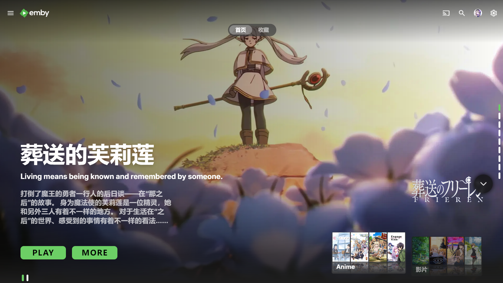

# 🌊 EmbyFlow

> **Modern. Lightweight. Responsive.**  
> 一个现代、轻量级且响应迅速的 Emby 首页轮播图插件。

**EmbyFlow** 是基于 [Emby-Home-Swiper-UI](https://github.com/sohag1192/Emby-Home-Swiper-UI) 深度优化与重构的现代化首页增强插件。在保留原版精美视觉体验的基础上，剔除了冗余功能，引入了骨架屏异步加载，并修复了核心的播放与刷新机制，只为提供极致流畅的体验。

## 📸 预览 (Preview)



---

## ✨ 核心特性 (Features)

### 🚀 极致性能 (Performance First)
- **异步加载与骨架屏**：实现了全新的骨架屏 (Skeleton Screen) 功能，在图片加载完成前提供优雅的占位动效，告别页面闪烁，大幅提升感知加载速度。
- **轻量化重构**：删除了原插件中非核心的冗余功能，精简了轮播图界面，使轮播图加载更迅速、占用更少资源。

### 📱 智能响应 (Responsive Design)
- **屏幕宽度检测**：新增了智能的屏幕宽度检测机制，确保轮播图在桌面、平板和移动端都能适配。（屏幕旋转时也有效果😎）

### 🛠️ 体验修复 (Bug Fixes & Polish)
- **播放进度修复**：修复了原插件中 "PLAY" 按钮的播放进度同步问题，现在可以准确续播，无缝衔接观影进度。
- **内容刷新机制**：重写了内容刷新逻辑，确保首页推荐内容能随媒体库更新即时、正确地刷新，不再展示过期信息。

### 🎨 继承优点
- 保持了原作现代化的 UI 设计风格，无缝融入 Emby 原生界面，提供沉浸式的视觉享受。

---

## 📥 安装 (Installation)

直接安装（修改方式）
将 home.js 拷贝到 Emby 的 Web UI 目录，并在 `index.html` 中引入该脚本即可完成安装。

步骤：
1. 找到 Emby 的 Web UI 目录（以群晖标准安装为例）：

    ```bash
    /volume1/@appstore/EmbyServer/system/dashboard-ui/
    ```

2. 将以下文件复制到该目录：

    - `home.js`

3. 编辑 `index.html`，在 `</head>` 前加入：

    ```html
    <!-- EmbyFlow -->
    <script src="home.js"></script>
    ```

4. 刷新 Emby Web 界面

    重启 Emby 服务或在浏览器中刷新页面，首页应显示轮播横幅。

5. 可选：调试与手动测试

    打开浏览器开发者工具（F12）查看控制台错误。可手动初始化测试：

    ```javascript
    HomeSwiper.init()
    ```


Docker Compose版Emby：
1. 首先

---

## 🙌 致谢 (Credits)

本项目基于以下项目开发。感谢原作者的创意与贡献。
>[Emby-Home-Swiper-UI](https://github.com/sohag1192/.Emby-Home-Swiper-UI) 
>[Nolovenodie/emby-crx](https://github.com/Nolovenodie/emby-crx)
